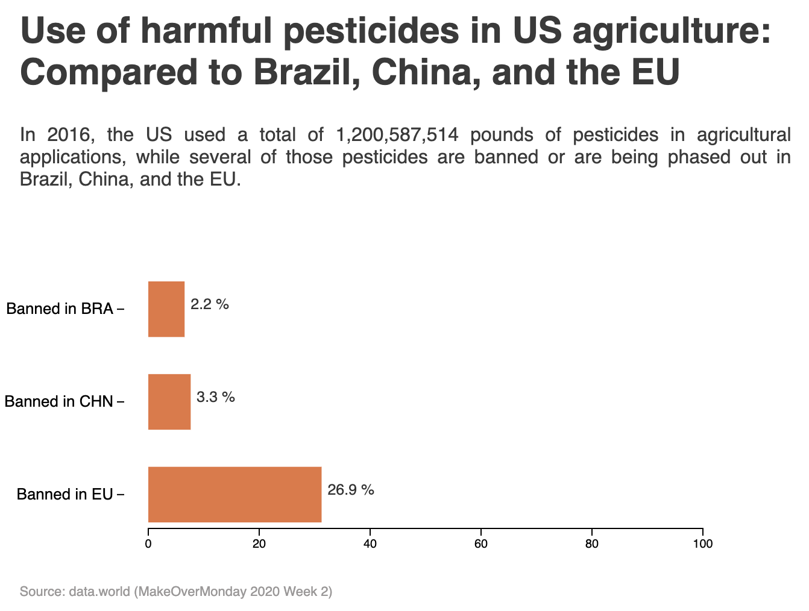

# Pesticides use in the US in 2016 | Data Visualization: d3.js v7

## Chart type: Bar
<!-- DESCRIPTION/ -->

## Visualization
<!-- DESCRIPTION/ -->
Bar chart to show the percent of total pesticides (used in the US agriculture) that are banned/phased out in Brazil, China, and the EU.

## Data
<!-- DESCRIPTION/ -->

Data file - data.js

- Columns - (**string**) category of data shown in relative terms of the pesticide use in US agriculture, (**string**) Amount of pesticides used (in pounds), (**float**) % use in terms of use in the US 

## Data Manipulation - Javascript
<!-- DESCRIPTION/ -->

Created object with the data required for plotting the chart. Extracted % values for pesticides banned in Brazil, China and the EU.
